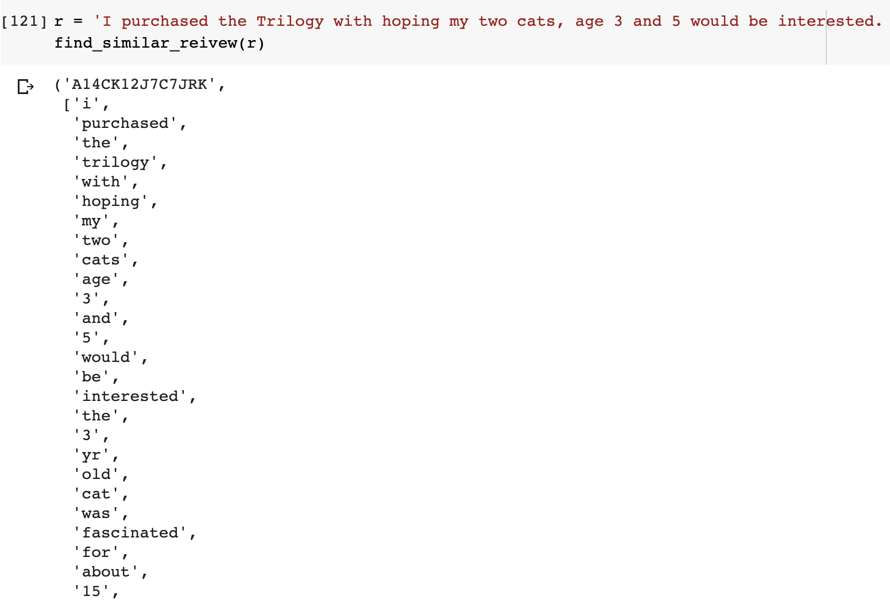
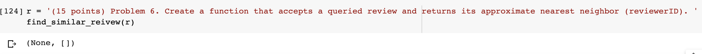
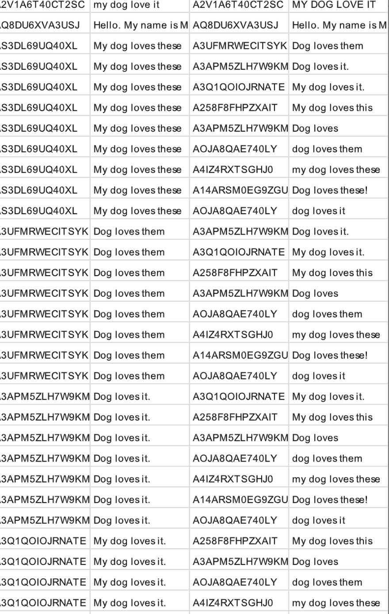

# Nearest-Neighbor-for-Amazon-Reivews

This is a course project for ESE 545 data mining at University of Pennsylvania.

- The goal is to find the nearest neighbors (Jaccard distance&lt;0.2) for 150K+ Amazon reviews as efficient as possible. And dump all the similar reviews into a csv file.

- k-shingle(a.k.a k-gram), Min-hashing and LSH algorithms are used to dramatically speed up the process.

- The whole process would be done within 10 minutes!!

- results:
1. similar review is found given text

2. similar review is not found given text

3. the csv file containing all the similar reviews in the dataset. The second and fourth column the similar pair of reviews, the first and third columns are corresponding reviewerID.

